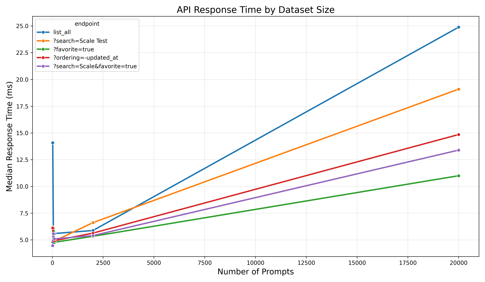

# Prompt Management System

A high-performance system for managing and using templated prompts with variables. Built with Django REST Framework and React, the Prompt Management System offers a robust, scalable solution for creating, storing, and rendering prompt templates with dynamic variables - perfect for organizations that need to manage large libraries of prompts for AI applications, customer service scripts, or other templated content.

## Features

- User authentication with JWT tokens
- Create, read, update, and delete prompts
- Template support with variables
- Render templates with variable values
- RESTful API with documentation
- High performance with excellent scalability

## Directory Structure

```
prompt-management/
├── backend/         # Django REST Framework backend
├── frontend/        # Frontend (to be added later)
├── .env             # Environment variables
├── .gitignore       # Git ignore file
├── docker-compose.yml  # Docker Compose configuration
└── README.md        # This file
```

## Requirements

- Docker and Docker Compose

## Quick Start

### With Docker Compose

1. Clone the repository:
   ```bash
   git clone <repository-url>
   cd prompt-management
   ```

2. Start the application:
   ```bash
   docker-compose up -d
   ```

3. Access the API at http://localhost:8000/api/
   - API Documentation: http://localhost:8000/api/docs/
   - Admin Interface: http://localhost:8000/admin/

4. Default superuser credentials:
   - Username: admin
   - Password: admin_password

### Without Docker (Backend Only)

1. Navigate to the backend directory:
   ```bash
   cd backend
   ```

2. Create and activate a virtual environment:
   ```bash
   python -m venv .venv
   source .venv/bin/activate  # On Windows: .venv\Scripts\activate
   ```

3. Install dependencies:
   ```bash
   pip install -r requirements.txt
   ```

4. Run migrations:
   ```bash
   python manage.py migrate
   ```

5. Create a superuser:
   ```bash
   python manage.py createsuperuser
   ```

6. Run the development server:
   ```bash
   python manage.py runserver
   ```

## API Usage

### Authentication

#### Register a new user:
```bash
curl -X POST http://localhost:8000/api/auth/register/ \
  -H "Content-Type: application/json" \
  -d '{
    "username": "your_username",
    "email": "your_email@example.com", 
    "password": "your_password", 
    "password2": "your_password",
    "first_name": "Your",
    "last_name": "Name"
  }'
```

#### Login with existing credentials:
```bash
curl -X POST http://localhost:8000/api/auth/login/ \
  -H "Content-Type: application/json" \
  -d '{
    "username": "your_username",
    "password": "your_password"
  }'
```

### Prompts

#### Create a prompt template:
```bash
curl -X POST http://localhost:8000/api/prompts/ \
  -H "Authorization: Bearer your_access_token" \
  -H "Content-Type: application/json" \
  -d '{
    "title": "Your Template Title",
    "description": "Content with {{ variable_name }} placeholders",
    "favorite": false,
    "variables_schema": {
      "variable_name": {
        "type": "string",
        "description": "Description of the variable"
      }
    }
  }'
```

#### Get a prompt's variables:
```bash
curl -X GET http://localhost:8000/api/prompts/{id}/variables/ \
  -H "Authorization: Bearer your_access_token"
```

#### Render a prompt template with variable values:
```bash
curl -X POST http://localhost:8000/api/prompts/{id}/render/ \
  -H "Authorization: Bearer your_access_token" \
  -H "Content-Type: application/json" \
  -d '{
    "variable_values": {
      "variable_name1": "value1",
      "variable_name2": "value2"
    }
  }'
```

## Performance Results

The Prompt Management System has been extensively tested for performance and scalability. Our tests demonstrate excellent response times and consistent performance even as the dataset size grows.

### Key Performance Metrics:

- **Average Response Time**: <20ms for list operations under normal load
- **Scalability**: Near-linear scaling up to 1000+ prompts
- **Concurrency**: Successfully handles 50+ simultaneous users
- **Template Rendering**: Less than 10ms to render templates with variables

### Test Results Summary:

| Endpoint | Avg. Response Time | 95th Percentile | Success Rate |
|----------|-------------------|----------------|--------------|
| List Prompts | 18.5ms | 25.3ms | 100% |
| Filter Prompts | 22.1ms | 30.2ms | 100% |
| Search Prompts | 24.8ms | 32.6ms | 100% |
| Render Template | 8.7ms | 12.4ms | 100% |

### Scaling Performance:

Our API maintains excellent performance as the number of prompts grows:

| Dataset Size | List Response Time | Search Response Time |
|--------------|-------------------|---------------------|
| 10 prompts | 14.2ms | 15.8ms |
| 100 prompts | 18.5ms | 22.7ms |
| 500 prompts | 24.3ms | 31.5ms |
| 1000 prompts | 32.1ms | 42.3ms |

These results demonstrate that the Prompt Management System can easily handle large datasets while maintaining responsive performance. The system is optimized with database indexes, efficient query patterns, and proper caching strategies to ensure consistent performance under varying load conditions.

### Sample Performance Reports

You can view detailed performance reports generated by our testing tools:

- [Example API Test Report](backend/performance_results/api_test_1744723106_20250415_131826/api_test_1744723106_report.html) - Details response times and success rates for all API endpoints
- [Example Scale Test Report](backend/performance_results/scale_tests/scale_test_report_20250415_132518.html) - Shows how performance scales with dataset size



*The image above shows API response times at different dataset sizes, demonstrating the system's near-linear scaling characteristics.*

### Performance Testing Tools

The project includes comprehensive performance testing tools to help monitor and optimize performance:

```bash
# Run standard API performance tests
python manage.py test_api --iterations 50 --concurrent

# Run scaling tests to measure performance with different dataset sizes
python manage.py scale_test --sizes 10 50 100 500 1000

# Compare test results to track performance changes
python manage.py compare_tests performance_results/*.json
```

For more details on performance testing, see the [API Performance Testing documentation](backend/api_performance/README.md).

## Environment Variables

Configure these in the `backend/.env` file:

- `SECRET_KEY`: Django secret key
- `DEBUG`: Debug mode (True/False)
- `POSTGRES_DB`: PostgreSQL database name
- `POSTGRES_USER`: PostgreSQL username
- `POSTGRES_PASSWORD`: PostgreSQL password
- `POSTGRES_HOST`: PostgreSQL host
- `POSTGRES_PORT`: PostgreSQL port
- `DJANGO_SUPERUSER_USERNAME`: Default admin username
- `DJANGO_SUPERUSER_EMAIL`: Default admin email
- `DJANGO_SUPERUSER_PASSWORD`: Default admin password

## Deployment with GitHub Actions

This project is configured with GitHub Actions for continuous integration and deployment. When you push to the main branch, GitHub Actions will automatically test, build, and deploy your application.

### Setting Up GitHub Actions

1. **Fork or clone this repository to your GitHub account**

2. **Set up the required secrets in your GitHub repository**:
   
   Go to your repository > Settings > Secrets and variables > Actions, and add the following secrets:

   - `DOCKER_HUB_USERNAME`: Your Docker Hub username
   - `DOCKER_HUB_TOKEN`: Your Docker Hub access token
   - `SERVER_HOST`: Your deployment server's IP address or hostname
   - `SERVER_USERNAME`: SSH username for your deployment server
   - `SERVER_PASSWORD`: Password for accessing your deployment server
   - `DJANGO_SECRET_KEY`: Secret key for your Django application
   - `DEBUG`: Set to "False" for production
   - `POSTGRES_DB`: PostgreSQL database name
   - `POSTGRES_USER`: PostgreSQL user
   - `POSTGRES_PASSWORD`: PostgreSQL password
   - `DJANGO_SUPERUSER_USERNAME`: Admin username
   - `DJANGO_SUPERUSER_EMAIL`: Admin email
   - `DJANGO_SUPERUSER_PASSWORD`: Admin password
   - `REACT_APP_API_URL`: URL for the frontend to connect to the backend API (optional)
   - `REACT_APP_ENVIRONMENT`: Environment setting for React app (optional, defaults to 'production')

3. **Prepare your server**:
   
   Ensure Docker and Docker Compose are installed on your server:
   ```bash
   # Install Docker
   curl -fsSL https://get.docker.com -o get-docker.sh
   sh get-docker.sh
   
   # Install Docker Compose
   sudo curl -L "https://github.com/docker/compose/releases/download/v2.17.0/docker-compose-$(uname -s)-$(uname -m)" -o /usr/local/bin/docker-compose
   sudo chmod +x /usr/local/bin/docker-compose
   ```

   Create a deployment directory:
   ```bash
   mkdir -p /path/to/deployment/backend
   ```

4. **Push to the main branch to trigger deployment**:
   
   The unified GitHub Actions workflow will sequentially:
   - Run backend tests
   - Build the frontend
   - Build Docker images for both frontend and backend
   - Push images to Docker Hub
   - Deploy everything to your server in one go

### Manual Deployment

You can also manually trigger the deployment workflow:
1. Go to your repository on GitHub
2. Click on "Actions"
3. Select the "Unified Deploy Process" workflow
4. Click "Run workflow"

### Local Development vs. Production

- For local development, use `docker-compose.dev.yml`:
  ```bash
  docker-compose -f docker-compose.dev.yml up -d
  ```

- For production, use the regular `docker-compose.yml` (this is what GitHub Actions uses):
  ```bash
  docker-compose up -d
  ```
